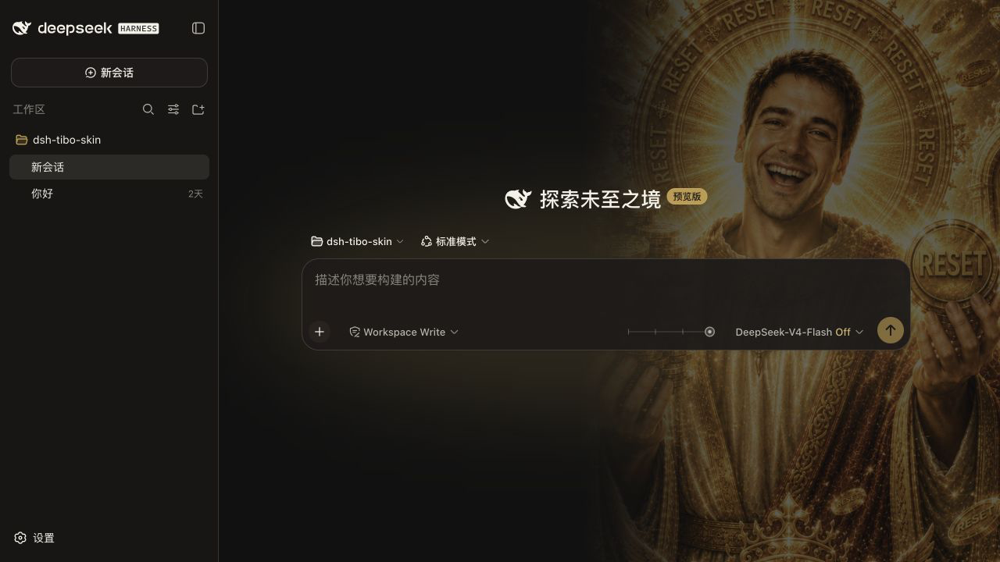
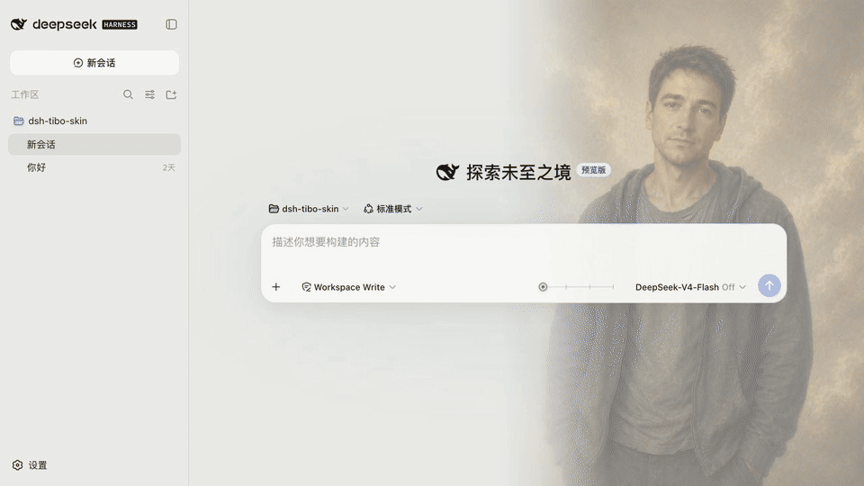

# Tibo Reset · DeepSeek Harness Skin

[中文版](README.md)

> **The world needs more Reset.**

## Installation

- #### Method 1: Prompt-assisted installation

<details>
  <summary>Expand installation prompt</summary>

Copy the following prompt into DSH. It performs a conflict check before installing the skin:

```text
Please install the “Tibo Reset” skin into DSH’s web profile. You must check for conflicts first and only continue after confirming that it is safe to proceed.

1. Before installation, perform a read-only inspection of the web profile’s package.json (dependencies and dsh.profile.bundles), the profile’s cordis.patch.yml, and $DSH_HOME/cordis.patch.yml if it exists.
2. Identify any other enabled skin, theme, or appearance plugins in the active bundles. Exclude @deepseek-ai/dsh-base, @deepseek-ai/dsh-web-app, and the target package dsh-client-liang-intensity-skin. Read each candidate package.json for its name, description, and dsh.client/dsh.bundle declarations; read its README only when necessary.
3. If any other skin plugin is enabled, list it and stop before installation. Ask me to disable it first. Do not modify any profile file or run the installation without my confirmation.
4. If no conflict is found, explicitly say “No other enabled skin plugins were detected,” then run:

dsh plugin --profile web add 'github:francis1104/dsh-tibo-skin'

5. After installation, read the web profile’s package.json and confirm that dsh-client-liang-intensity-skin appears in both dependencies and dsh.profile.bundles. Then inspect the target package.json for its dsh.client/dsh.bundle declarations and the liang-intensity-skin loader registration. Report installation or registration failure if any item is missing.
6. Tell me how to restart DSH Web. Do not install, disable, or remove any other skin on my behalf.
```

</details>

- #### Method 2 (recommended): use the [CLI installation](#cli-install) instructions below. Disable other skin plugins before installing to avoid conflicts.

If you prefer a manual installation or want to develop locally, use the CLI instructions below.

## Preview

<table>
  <tr>
    <td width="50%" align="center">
      
      <br>
    </td>
    <td width="50%" align="center">
      
      <br>
    </td>
  </tr>
</table>

## Interaction model

- The slider reads the current model’s `reasoning.efforts` metadata rather than assuming a fixed number or naming scheme.
- Any number of efforts is distributed evenly across the 0–30 visual scale: two efforts use `0 / 30`, three use `0 / 15 / 30`, and five use `0 / 7.5 / 15 / 22.5 / 30`.
- While dragging, the slider only updates a continuous visual preview. On pointer release, keyboard completion, or blur, it snaps to the nearest effort and submits that effort’s original provider ID through the official ModelDirectory.
- Models without reasoning support, or with only one available effort, do not show the slider.
- Addressed subagents do not show or submit the slider.

The six continuous Tibo Reset visual anchors follow the original progressive “ascension” structure:

| Strength | Label | Quota mythology |
|---:|---|---|
| 0 | `小难Tibo` | Quota is running low; quietly holding on |
| 6 | `牢Tibo` | The DMs and prayers have begun |
| 12 | `Tibo子` | A “Maybe” has arrived |
| 18 | `Tibo圣` | “Reset this afternoon” is officially announced |
| 24 | `Tibo神` | A banked reset lands; a ceremonial reset begins |
| 30 | `Tibo祖` | The cyber godfather presses the button and refills everyone’s quota |

## Appearance toggle

The toggle is located at `Settings → General Settings → Appearance`:

- `Tibo Reset`: shows the reasoning slider and enables the portrait, background, and adaptive color system.
- `Native`: removes the background layer, skin variables, and slider, restoring the native Harness interface.

The choice is stored locally in the current browser and does not change the model configuration.

<a id="cli-install"></a>

## CLI installation

You must install [DeepSeek Harness](https://github.com/deepseek-ai/deepseek-harness) first. The plugin has been verified with `0.1.0-rc.8`. Installation can be performed while DSH is running because it only changes files on disk; restart DSH afterward. Choose one of the following methods:

> Disable other skin plugins before installing to avoid conflicts.

### Method 1: Install the latest version from GitHub (recommended)

```sh
dsh plugin --profile web add 'github:francis1104/dsh-tibo-skin'
dsh --profile web --dump-config | grep -B1 -A2 liang-intensity
```

### Method 2: Install a GitHub Release tarball

Download `dsh-client-liang-intensity-skin-0.1.6.tgz` from this repository’s [Releases](https://github.com/francis1104/dsh-tibo-skin/releases) page. The archive already contains the built `lib/client.js`, so no prepare script is required during installation:

```sh
dsh plugin --profile web add ./dsh-client-liang-intensity-skin-0.1.6.tgz
```

This is useful when Git-based installation is inconvenient. Relative paths are resolved from the directory where you run the command.

### Method 3: Clone the repository and install from a local path

```sh
git clone https://github.com/francis1104/dsh-tibo-skin.git
cd dsh-tibo-skin
dsh plugin --profile web add .
```

`dsh plugin` anchors relative paths to the directory where the command is run, not to the profile directory. Running `add .` from the clone therefore installs a link dependency pointing at the clone: run `npm run build` after changing the client source, then restart DSH. There is no need to reinstall the plugin for every iteration.

### Verification and restart

After a successful installation, `dsh plugin` automatically registers the plugin in the profile’s `dsh.profile.bundles` (see `~/.dsh/profiles/web/package.json`). No manual configuration edit is required. The `--dump-config` output should contain the `dsh-client-liang-intensity-skin` configuration layer; the `grep` command above is provided for that check.

If DSH is already running, choose one of these restart options:

- **Restart automatically:** terminate the old process and run `dsh web` again.
- **Restart manually (recommended):** press Ctrl+C in the terminal running DSH, then run `dsh web`.

After restarting, the browser loads the client plugin automatically; a hard refresh is not required. The current session may be interrupted, but DSH persists sessions on disk and can restore them after restart.

### Uninstall

```sh
dsh plugin --profile web remove dsh-client-liang-intensity-skin
```

`remove` removes the plugin from `dsh.profile.bundles` automatically. The settings entry disappears after DSH restarts.

### Troubleshooting

- **pnpm blocks build scripts:** pnpm ≥ 10 does not run third-party build/prepare scripts by default. This skin has no prepare script, so installation normally does not trigger one. If pnpm fails and prints an approval request, follow DSH’s instructions and add the relevant key under `allowBuilds` in `~/.dsh/profiles/web/pnpm-workspace.yaml`, then retry.
- **Network access:** Method 1 requires access to github.com because pnpm fetches through codeload; Method 2 only requires downloading the GitHub Release attachment.
- **pnpm is missing:** `dsh plugin` requires pnpm to be available on `PATH` and reports this explicitly when it is not.
- **Port already in use:** `dsh web` listens on port 3080 by default; use `--port` to change it and make sure the previous process has exited before restarting.

## Local development

```sh
npm install
npm test
npm run build
```

After changing the client source, run `npm run build` and commit the regenerated `lib/client.js` and source map together with the source change.

## Current asset notes

The complete 24-image sequence is now integrated into the plugin, and the slider and runtime display are fully usable. However, continuity between adjacent frames is not perfectly consistent yet: facial details, poses, and stage-specific elements may shift slightly from one image to the next.

This is my first time building a batch portrait-generation workflow of this kind, so the consistency-control and frame-by-frame refinement process is still evolving. For now, the priority is a complete 24-frame sequence and stable slider behavior; individual transitions can be refined in a future pass.

## Inspiration and source material

The original visual source is [Lichtspektrum/liang-intensity-calibrator](https://github.com/Lichtspektrum/liang-intensity-calibrator). It is an independent web-based “Liang intensity calibrator”: a 31-level scale from `-15` to `+15`, a continuous slider, and video frames that evolve the same character from a restrained low-intensity state toward the crowned “Liang Ancestor” state. The upstream project also supports mouse, touch, and keyboard interaction, as well as community voting and a timeline view.

[kingOfSoySauce/dsh-liang-skin](https://github.com/kingOfSoySauce/dsh-liang-skin) is a DeepSeek Harness skin fork based on that upstream project and the direct predecessor to this plugin. It connects the Liang-style intensity slider to DSH model and reasoning-strength selection. This repository continues that DSH adaptation under the Tibo Reset name, retaining the legacy package and loader identifiers needed for compatibility while revising the portrait assets, rank labels, interaction notes, and documentation.

Tibo Reset remaps the upstream project’s 31-level visual intensity sequence onto this plugin’s 0–30 scale, keeps its six-stage structure and portrait-evolution concept, and connects 24 reviewed portrait anchors to DeepSeek Harness reasoning-effort selection under the Tibo Reset name. The upstream voting backend, community averages, and timeline features are not part of this plugin.

All runtime assets are bundled with the plugin; no additional download is required after installation. The client uses 24 reviewed portrait anchors and switches directly to the nearest anchor while dragging; it does not crossfade between images.
